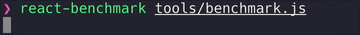

# react-benchmark

[](https://travis-ci.org/Rowno/react-benchmark)
[](https://david-dm.org/Rowno/react-benchmark)



A tool for benchmarking the render performance of React components.

It compiles the benchmark code into a minified production bundle using Webpack and then runs it in headless Chrome to benchmark the real production code in a real production environment.

_Note: the benchmark numbers aren՚t completely accurate and should only be used relatively to compare the performance difference of code changes or different implementations._

## Install

```sh
yarn global add react-benchmark
# or
npm install -g react-benchmark
```

## Usage

```
Usage
  $ react-benchmark <path>

Options
  <path>          Path to a JavaScript file that exports the function to be benchmarked.
  --debug, -d     Run a development build instead of a production build to aid debugging.
  --devtools, -t  Run Chrome in windowed mode with the devtools open.
  --version       Prints the version.
  --help          Prints this message.

Examples
  $ react-benchmark benchmark.js
```

The `<path>` file should export a function that returns the component instance you want to benchmark. For example:

```js
import React from 'react'
import Component from './src'

export default function() {
  return <Component hello="world" />
}
```

You can import anything that Webpack supports out of the box and your code will be transpiled with Babel using your local Babel config.

## API

`react-benchmark` exports a `ReactBenchmark` class that instantiates an event emitter with a `.run()` method. Calling the `.run()` method will start the benchmark with the provided options.

```js
const ReactBenchmark = require('react-benchmark')
const reactBenchmark = new ReactBenchmark()

reactBenchmark.on('progress', currentStats => {
  console.log(currentStats)
})

const result = await reactBenchmark.run('benchmark.js')
```

See the [CLI code](lib/cli.js) for a full implementation example.

### .run(filepath, options)

Starts the benchmark. Returns a Promise that will resolve to a [Benchmark](https://benchmarkjs.com/docs) object containing the stats once the benchmark has been completed.

#### filepath

Type: `String`

Path to the benchmark file to run. See the [Usage](#usage) section for more details.

#### options

Type: `Object`

Optional object containing additional options.

##### debug

Type: `Boolean`<br>
Default: `false`

Run a development build instead of a production build to aid debugging.

##### devtools

Type: `Boolean`<br>
Default: `false`

Run Chrome in windowed mode with the devtools open.

### Events

#### webpack

Fired when the Webpack build has started.

#### server

Fired when the webserver has started.

#### chrome

Fired when Chrome has launched.

#### start

Fired when the actual benchmark starts.

#### progress

Fired every time a benchmark cycle has been completed. Gets passed a [Benchmark](https://benchmarkjs.com/docs) object with the current stats. This event will be fired multiple times per run.

#### console

Fired every time something is logged to Chrome՚s console. Gets passed a `{type, text}` object.

## License

react-benchmark is released under the ISC license.

Copyright © 2018, Roland Warmerdam.
